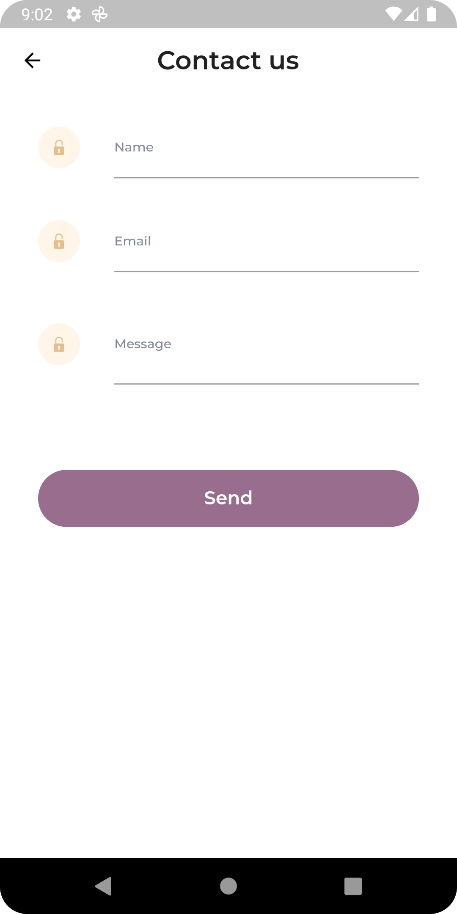

## Mobile Developer Test Task

General task is to create mobile application with contact page using Flutter/Dart mobile framework, provided screenshot as a design reference, and then send form content to the server.

### Tasks:

**1.** Create empty repository in your GitHub account.

**2.** Create mobile application using Flutter/Dart mobile framework. Application should contain:
* Contact page with form
* Form should contain 3 fields: name, email, message
* Form should contain Send button
* Form should contain validation for all fields (all fields are required)
* Form should contain validation for email field (email field should contain valid email address)
* Send button should be disabled until all fields are filled and valid
* Send button should be switched to "please wait" mode on click and enabled again after response from the server
* Form should show error message if server response is not 201
* Form should show success message if server response is 201



**3.** Send form data in application/json format to the next endpoint:
```
POST https://api.byteplex.info/api/test/contact/
```
Json format example:
```
{
    "name": "",
    "email": "",
    "message": ""
}
```

**4.** Commit and push your code to the repository.

### Task result:

- Link to the source code repository
